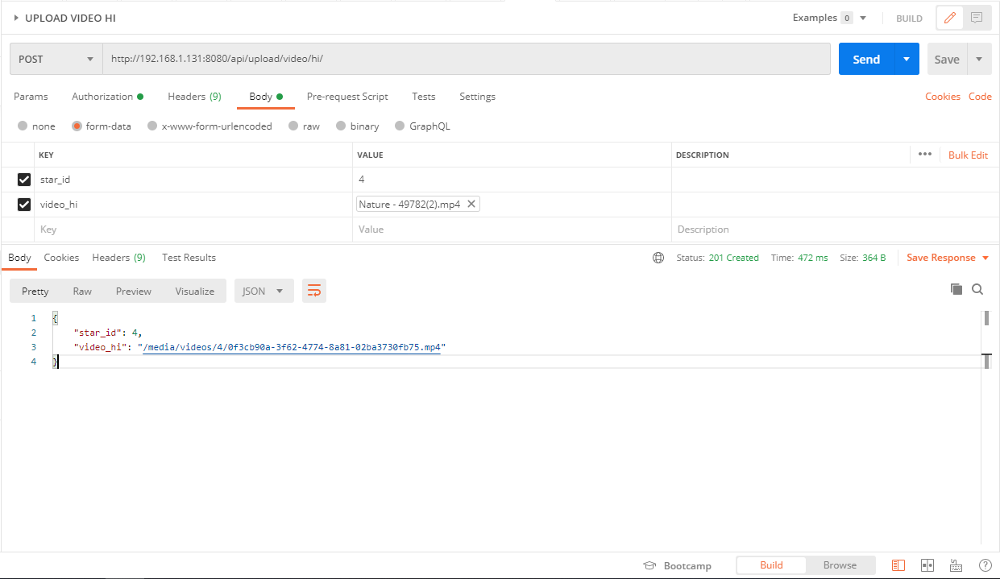
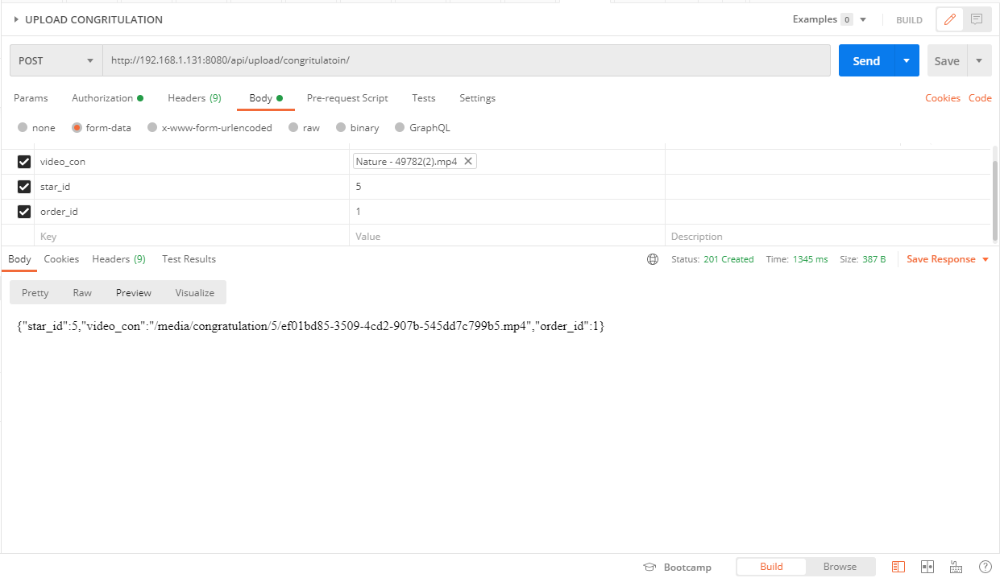

**My Star**

*End-points*

* http://192.168.1.131:8080/api/login/ - логин

response: 

    201

* http://192.168.1.131:8080/api/registration/ - регистрация пользователя

response: 

    201

* http://192.168.1.131:8080/api/categories/ - GET категории

response: 

    201

* http://192.168.1.131:8080/api/star/create/- регистрация звезды

response: 

    201

* http://192.168.1.131:8080/password_reset/ - Смена пароля

request:

    {
        "email": "niletto@star.com"
    }
    
response: 

    {
        "status": "OK"
    }
    
    Приходит на почту ссылка типа:
        http://127.0.0.1:8000/password_reset/confirm/?token=121258a800cd8c3a66e9a849f1d3dd601c077f4
        Которая ведет на форму смены паоля
        
* http://127.0.0.1:8000/password_reset/confirm/?token=121258a800cd8c3a66e9a849f1d3dd601c077f4

request:

    {
    "password": "admin1234",
    "token": "121258a800cd8c3a66e9a849f1d3dd601c077f4"
    }
    
response:

    {
        "status": "OK"
    }
        
* http://192.168.1.131:8080/api/star/getlist/ - список всех звезд

response: 

    201

* http://192.168.1.131:8080/api/star/id/?id=1 - [GET] звезду по id

request:

    {
        "star_id" : "3"
    }

response:

    {
        "username": "zemfira",
        "phone": 9787896546,
        "email": "zemfira@star.com",
        "price": "15000.00",
        "cat_name_id": 2,
        "rating": 2,
        "is_star": true
    }

* http://192.168.1.131:8080/api/star/category/?id=1 - [GET] звезд по id категории

response:

    [
        {
            "username": "niletto",
            "phone": 9787892356,
            "email": "niletto@star.com",
            "price": "15000.00",
            "cat_name_id": 1,
            "rating": 2,
            "is_star": true
        }
    ]

* http://192.168.1.131:8080/api/ratestar/ - [PUT] проголосовать за звезду

request:

    {
        "rating": "1",
        "adresat": 1,
        "adresant": 3
    }

response: 

    201

* http://192.168.1.131:8080/api/star/like/ - [POST] поставить лайк

requset:
    
    {
        "star_id": 39,
        "cust_id": 1
    }
    
response:

    если лайк уже стоит:
        {'Лайк уже стоит'},  403
    если лайк:
        {"Оценка выставлена"} 201
    если отпраить плохие данныеЖ
        error.data 400

* http://192.168.1.131:8080/api/order/ - [POST] сделать заказ

request:

    {
        "customer_id": "1",
        "star_id": "3",
        "order_price": "4000.00",
        "for_whom": "Для Мамы",
        "comment": "Хочу поздравить маму с днем рождения",
        "status_order": "0"
    }

response: 

    201

* http://192.168.1.131:8080/api/orderaccept/ - [POST] звезда принимает/отклоняет заказ

request:

    {
        "order_id" : "5",
        "accept": "accept"
    }

response: 

    201
    
* http://192.168.1.131:8080/api/order/cust/detail/ - [GET] заказчик получает информацию по заказу

request:

    {
        "order_id": "2",
        "star_id": "5"
    }
    
response(если звезда не прислала поздравление):

    {
        "star_username": "Окимирон",
        "order_price": 88888.0
    }
    
response(если звезда прислала поздравление):

    {
        "star_username": "Окимирон",
        "order_price": 88888.0,
        "video": "congratulation/5/ef01bd85-3509-4cd2-907b-545dd7c799b5.mp4"
    }

* http://192.168.1.131:8080/api/personal/ - лк для звезды и заказчика

request:

    {
        "user_id": "1",
        "is_star": 0
    }

response:

    [
        {
            "username": "myname",
            "phone": 9941622229,
            "email": "poor@test.com",
            "date_of_birth": "1999-08-05",
            "is_star": false
        },
        {
            "orders": [
                {
                    "customer_id": 1,
                    "star_id": 3,
                    "payment_id": "",
                    "order_price": "4000.00",
                    "ordering_time": "2020-09-23T06:34:49.397971Z",
                    "for_whom": "Для Мамы",
                    "comment": "Хочу поздравить маму с днем рождения",
                    "status_order": 0
                },
                {
                    "customer_id": 1,
                    "star_id": 3,
                    "payment_id": "28153142-0a0c-47cd-b253-01e337034a69",
                    "order_price": "4000.00",
                    "ordering_time": "2020-09-22T13:45:05.643858Z",
                    "for_whom": "Для Мамы",
                    "comment": "Хочу поздравить маму с днем рождения",
                    "status_order": 1
                },
                {
                    "customer_id": 1,
                    "star_id": 2,
                    "payment_id": "",
                    "order_price": "15000.00",
                    "ordering_time": "2020-09-22T13:22:17.143066Z",
                    "for_whom": "Для Мамы",
                    "comment": "Хочу поздравить маму с днем рождения",
                    "status_order": -1
                }
            ]
        }
    ]

* http://192.168.1.131:8080/payments/?order_id=1 - создание платежа (холд)

    редирект на страницу оплаты
    
* http://192.168.1.131:8080/payments/notifications/ -  списание денег
   
   редирект на страницу оплаты
   
* http://192.168.1.131:8080/api/upload/avatar/ - загрузить фотку (до 15 мб)

request(multipart/formdata):
response:
    

* http://192.168.1.131:8080/api/upload/video/hi/ - загрузить видео приветсвие звезды

request(multipart/formdata):
response:
    
    
* http://192.168.1.131:8080/api/upload/congritulatoin/ - загрузить поздравление

request(multipart/formdata):
response:
    

   
   